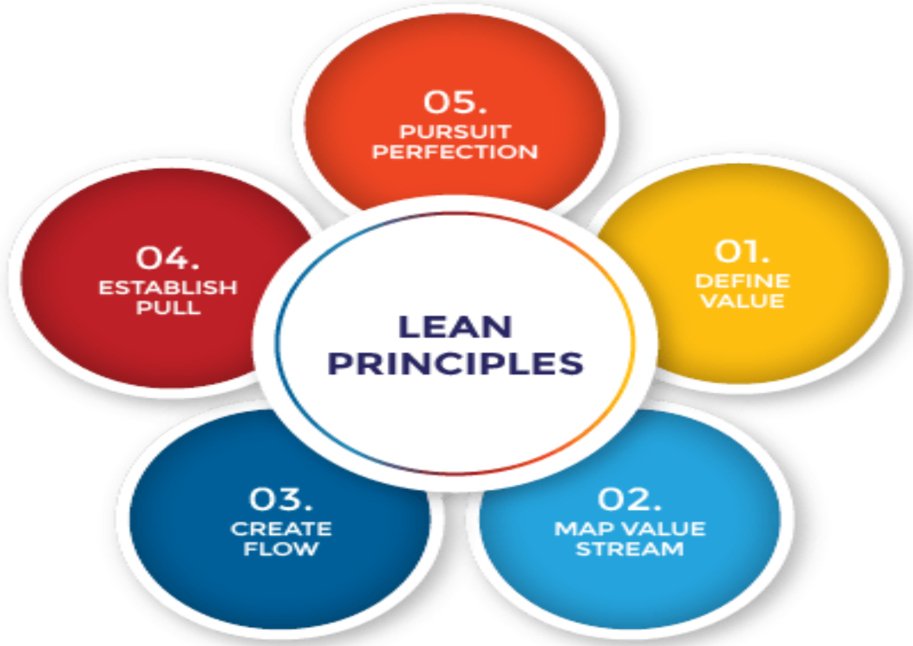

# Lean Principle
Lean is a way of thinking about creating needed value with fewer resources and less waste. Lean is also a practice consisting of continuous experimentation to achieve perfect value with zero waste. Lean thinking and practice occur together.

Lean practice begins with the work of the actions that directly and indirectly create value for the customer and the people doing that work. Through ongoing experimentation, workers and managers learn by innovating in their work, whether physical or knowledge work, to achieve better quality and flow, less time and effort, and lower cost.

An organization characterized by lean practice is highly adaptive to its ever-changing environment compared to its peers because of the systematic and continuous learning created by lean thinking and practice.
---

## The Five Lean Principles Explained

## 1. Define Value
To understand the first principle of defining customer value, it is important to know what value is. Value is what the customer is willing to pay for.

It is essential to discover the actual or latent needs of the customer. Sometimes customers may not know what they want or may be unable to articulate it, especially for new products or technologies.

Techniques such as interviews, surveys, demographic analysis, and web analytics help uncover what customers find valuable. These qualitative and quantitative methods reveal what customers want, how they want the product or service delivered, and the price they are willing to pay.
---

## 2. Map the Value Stream
The second Lean principle focuses on identifying and mapping the value stream. The goal is to use customer value as a reference point and identify all activities contributing to that value.

Activities that do not add value are considered waste. Waste falls into two categories:
- Non-value-added but necessary
- Non-value-added and unnecessary
Unnecessary waste should be eliminated, while necessary waste should be minimized. This ensures customers receive exactly what they want while reducing production costs.
---

## 3. Create Flow
After removing waste from the value stream, the next step is ensuring the remaining activities flow smoothly without interruptions or delays.

Strategies for creating flow include:
- Breaking down steps
- Reconfiguring production processes
- Leveling workloads
- Creating cross-functional teams
- Training employees to be multi-skilled and adaptive
---

## 4. Establish Pull
Inventory is one of the biggest sources of waste in production systems. A pull-based system limits inventory and work in progress (WIP) while ensuring materials and information are available when needed.

Pull systems support Just-in-Time production, where products are created only when needed and in the required quantities. These systems are driven by customer demand, ensuring products meet customer needs efficiently.
---

## 5. Pursue Perfection
Waste reduction is achieved through the first four principles:
1. Define value
2. Map the value stream
3. Create flow
4. Establish pull
The fifth principle, pursuing perfection, is the most critical. It embeds continuous improvement into organizational culture. Every employee strives for excellence while delivering customer-focused products. The organization becomes a learning system that improves continuously.
---

## The 8 Types of Waste (DOWNTIME)
| Waste | Meaning | Example |
|-----|--------|---------|
| **D – Defects** | Errors, rework | Bug fixes |
| **O – Overproduction** | More than needed | Unused features |
| **W – Waiting** | Idle time | Waiting for reviews |
| **N – Non-utilized talent** | Skills unused | Developers doing admin work |
| **T – Transportation** | Unnecessary movement | Excess handoffs |
| **I – Inventory** | Excess work | Too many open tickets |
| **M – Motion** | Unnecessary actions | Switching tools |
| **E – Extra processing** | More work than required | Over-documentation |