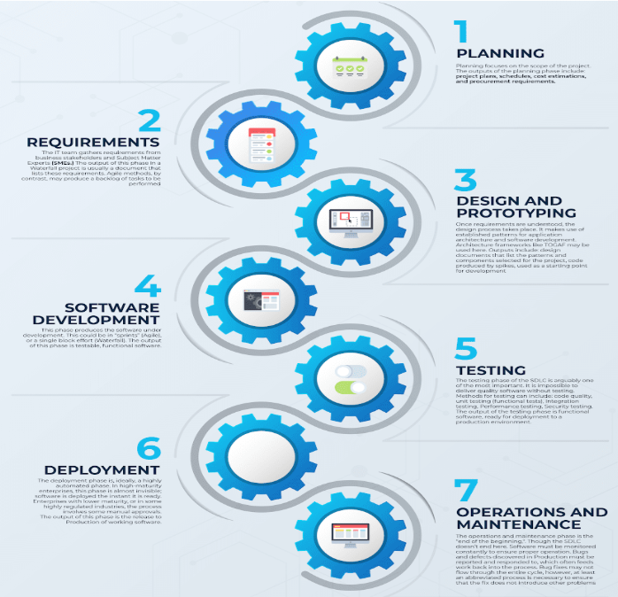
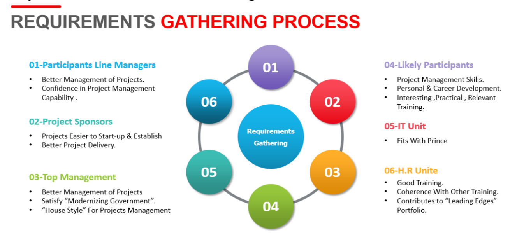
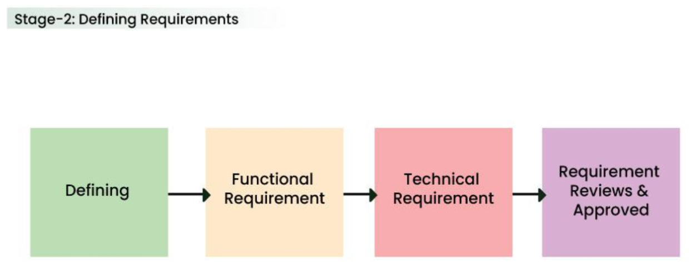
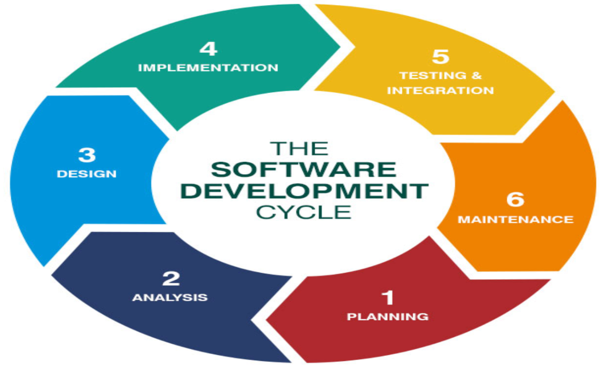
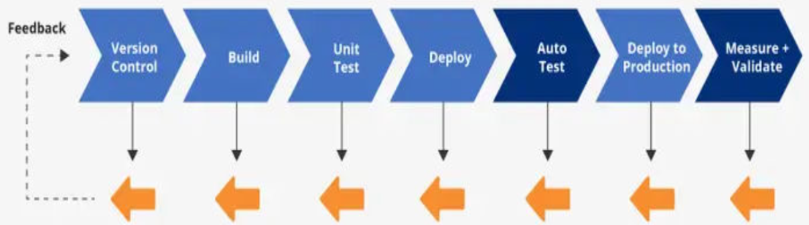

# SOFTWARE DEVELOPMENT LIFE CYCLE (SDLC)

The SDLC is a structured process that guides software teams from understanding the problem to delivering and maintaining a functional product.

The SDLC is a structured approach used to develop high-quality software through five phases:

1. **Requirements** – Collect and document user needs.  
2. **Design** – Create system architecture, UI, and technical structure.  
3. **Implementation** – Write and integrate code to build the software.  
4. **Testing** – Verify the product’s correctness, quality, and performance.  
5. **Deployment** – Release the finished product to users.

Each phase depends on the previous one, forming a continuous and interconnected workflow that ensures accuracy, efficiency, and customer satisfaction.

---

## 1️⃣ Requirements Phase – Understanding the Problem

This is the starting point of the SDLC and the most critical phase.

### What Happens Here?

- Meet with clients, stakeholders, and users to understand their needs.
- Identify features, constraints, and expectations.
- Document everything in a Software Requirement Specification (SRS).
- Define system goals, inputs, outputs, and user interactions.

### Why It’s Important

- Ensures everyone understands the project clearly.
- Prevents confusion later in development.
- Reduces redesign and cost by identifying needs early.

---

## 2️⃣ Design Phase – Planning the Solution

### What Happens Here?

- Convert requirements into a technical blueprint.
- Create system architecture, database design, and UI/UX layouts.
- Decide technologies, frameworks, and tools.
- Break the system into modules or components.

### Key Design Types

- **High-Level Design (HLD):** Overall system structure  
- **Low-Level Design (LLD):** Detailed logic for each component  

### Why It’s Important

- Acts as the roadmap for developers.
- Ensures the system is structured, scalable, and efficient.
- Prevents coding errors caused by poor planning.

---

## 3️⃣ Implementation Phase – Building the System

### What Happens Here?

- Developers write code according to the design.
- Frontend, backend, and database are developed simultaneously or in parts.
- Programmers follow coding standards and version control.
- Modules are created and integrated step-by-step.

### Why It’s Important

- This is where the actual product is built.
- High-quality coding determines reliability and maintainability.
- Good implementation minimizes bugs in later stages.

---

## 4️⃣ Testing Phase – Ensuring Quality and Accuracy

### What Happens Here?

- Testers execute various tests to find bugs, errors, and vulnerabilities.
- Verify that the software meets requirements from Phase 1.

Testing includes:
- **Unit Testing:** Individual modules
- **Integration Testing:** Interaction between modules
- **System Testing:** Complete system behavior
- **UAT (User Acceptance Testing):** End-user validation

### Why It’s Important

- Improves software quality and performance.
- Prevents failures after deployment.
- Ensures the system works correctly under real-world conditions.

---

## 5️⃣ Deployment Phase – Delivering the Product

### What Happens Here?

- Software is installed or released to end users.
- Deployment may be:
  - Full Release
  - Phased Release
  - Pilot/Beta Release
- DevOps pipelines (CI/CD) may automate deployment.
- Real-world performance is monitored.

### Why It’s Important

- Makes the software usable for customers.
- Ensures smooth installation, configuration, and operation.
- Final step before maintenance and updates.

---

## 🔄 How the Phases Interconnect

### Connection Flow

- Requirements guide the Design.
- Design guides Implementation.
- Implementation is validated through Testing.
- Testing prepares the software for Deployment.
- Deployment generates real feedback → which becomes new Requirements.

This creates a continuous cycle of improvement.
