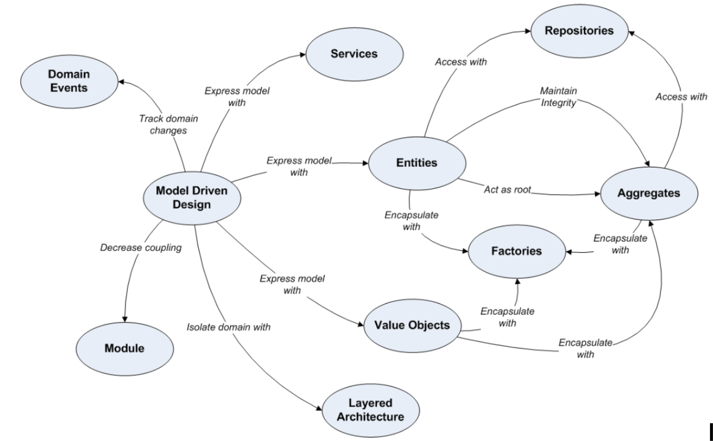
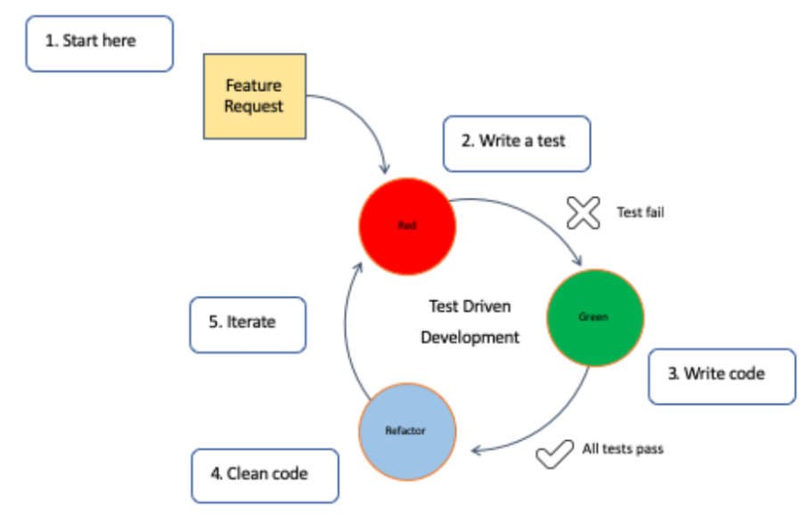
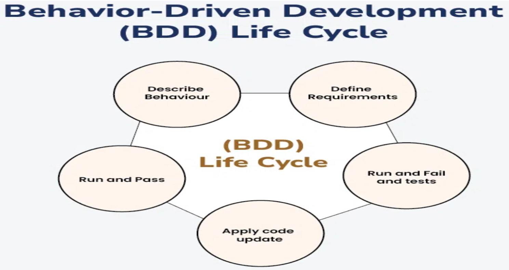

# 1️⃣ Domain-Driven Design (DDD)

## What is DDD?

Domain-Driven Design is a software development approach that focuses on understanding the business domain deeply and structuring software around it.  
It encourages collaboration between developers and domain experts.

---

## 🔹 Key Principles
- **Ubiquitous Language** – Shared language used by developers + domain experts.
- **Domain Model** – A conceptual model representing business logic.
- **Bounded Context** – Clear boundaries where a specific model is valid.
- **Entities, Value Objects, Aggregates** – Building blocks that model real-world objects.
---

## 🔹 Why It’s Useful
- Ensures the software truly solves business problems.
- Reduces complexity by splitting large systems into smaller models.
- Leads to scalable and maintainable architecture.
---

## 🔹 Steps in DDD (Highlighted)

### 1. Understand the Domain
- Collaborate with domain experts (e.g., bankers, doctors, logistics managers).
- Identify business rules, processes, and vocabulary.

### 2. Define the Ubiquitous Language
- Create a shared language used by developers + business experts.
- Example: “Order”, “Inventory”, “Cart”, “Shipment”.

### 3. Identify Bounded Contexts
- Divide the system into smaller independent areas.
- Example: Order Management, Inventory, Billing.

### 4. Design Domain Models
- Identify Entities, Value Objects, Aggregates.
- Define business logic inside models.

### 5. Implement the Domain
- Write code following the domain model and rules.
- Use repositories, services, and aggregates.
---

## 🔹 Real-World Use Case (DDD)

**E-commerce Platform (Amazon-like)**
- Domain experts explain: ordering, payments, inventory control.
- Bounded contexts: Order, Payment, Delivery, Inventory.
- A shared language ensures everyone understands terms like `OrderStatus`, `CartItem`, `ShippingCost`.

Outcome: A scalable, modular system where teams work independently.
---

# 2️⃣ Test-Driven Development (TDD)

## 📌 What is TDD?

Test-Driven Development is a method where tests are written before the code itself.  
The goal is to ensure correctness and drive design through tests.
---

## 🔹 The Three-Step Cycle (Red → Green → Refactor)

### 1. Red – Write a Failing Test
- Write a unit test describing the expected behavior.
- Run it — it fails because functionality doesn't exist yet.

### 2. Green – Write Minimum Code to Pass
- Write the simplest possible code to make the test pass.

### 3. Refactor – Improve Code Quality
- Clean up the code while keeping tests green.
- Improve structure, remove duplication.

### 4. Repeat
- Create new tests and continue the cycle.
---

## 🔹 Real-World Use Case (TDD)

**Banking System – Money Transfer Feature**
- Write a test: “transfer ₹500 from Account A to B should reduce A’s balance and increase B’s balance.”
- Test fails → write minimum code → test passes → refactor.

Outcome: High reliability in financial operations where mistakes are expensive.
---

## 🔹 Why Use TDD?
- Reduces bugs dramatically.
- Improves modularity and test coverage.
- Encourages writing clean, simple code.
---

# 3️⃣ Behavior-Driven Development (BDD)

## 📌 What is BDD?

BDD extends TDD by focusing on behavior of the system as expected by users and stakeholders.  
It uses natural language to describe test scenarios.
---

## 🔹 Why BDD Is Effective
- Encourages communication between developers, QA, and business teams.
- Human-readable tests ensure clarity.
- Aligns development with real user expectations.
---

## 🔹 Steps in BDD (Highlighted)

### 1. Discover
- The team collaborates with stakeholders to understand expected behavior.
- Identify user scenarios.

### 2. Define Using Gherkin Syntax
Write test scenarios in natural language:
- Given the user is logged in
- When they add an item to the cart
- Then the item should appear in the cart

### 3. Implement
- Developers write code to fulfill the behavior.
- Automated tests executed using tools like Cucumber or Behave.

### 4. Validate
- Stakeholders confirm that the behavior matches expectations.
---

## 🔹 Real-World Use Case (BDD)

**Food Delivery App (Swiggy/Zomato-like)**
Scenario: User adds food to cart
- Given the user has selected a restaurant
- When the user taps “Add to Cart”
- Then the item should appear in the cart with quantity = 1
- The business team approves the behavior.
- The developer writes code to satisfy it.
- QA automates the scenario.

Outcome: Ensures the app behaves exactly how users expect.
---

## 📘 Summary Table

| Concept | Focus | Who is Involved? | Output |
|------|------|------------------|--------|
| DDD | Business domain & structure | Developers + Domain experts | Domain models, bounded contexts |
| TDD | Code correctness | Developers | Unit tests, refactored code |
| BDD | User behavior & expectations | Developers + Testers + Business | Gherkin scenarios, acceptance tests |
