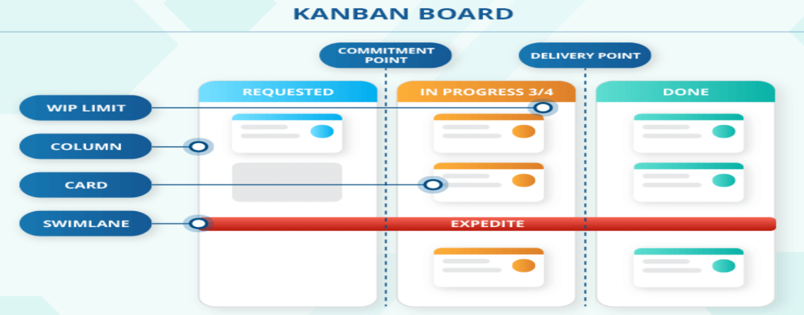

# What is Kanban?

Kanban is a visual method for managing workflow at the individual, team, and even organizational level. Pronounced “kahn-bahn,” the term translates from its original Japanese to “visual signal” or “card.”

Unlike other workflow management methods that force change from the outset, Kanban is about evolution, not revolution. It hinges on the fundamental truth that you must know where you are before you can get to your desired destination.

Kanban can be applied to virtually any type of work that follows a repeatable process; if your work follows the pattern of “To Do,” “Doing,” and “Done,” it can be managed on a Kanban board.

Kanban is a visual work management system that provides a clear representation of work progression within a process.

It is a visual presentation of both the workflow process and the tasks in transit.

The primary aim of Kanban is to identify potential bottlenecks in your process and resolve them, enabling work to flow efficiently at an optimal pace and ensuring cost-effectiveness.

Kanban is a visual workflow management method used to manage, track, and improve work processes by making work visible and limiting how much work is done at a time.

It originated in Toyota’s manufacturing system and is now widely used in software development, IT operations, and project management.

---

## Key Kanban Practices and Concepts

Kanban is immensely helpful because it is extremely flexible, but there are some key Kanban practices and concepts that guide successful implementation.

### Visualize Work
By creating a visual model of your work and process, you can observe the flow of work moving through the Kanban system. Making work visible, along with visual indications of blockers, bottlenecks, and queues, leads to increased communication and collaboration.

This helps teams understand how fast work moves through the system and where to focus efforts to improve flow.

### Limit Work-in-Process
By limiting how much unfinished work is in process, you can reduce the time it takes an item to travel through the Kanban system.

This helps avoid problems caused by task switching and reduces the need for constant reprioritization. Work-in-process (WIP) limits enable teams to deliver quality work faster in a sustainable manner.

### Focus on Flow
Using WIP limits and team-driven policies, Kanban systems help to:
- Improve the flow of work
- Collect metrics to analyze flow
- Identify early indicators of potential problems

### Continuous Improvement
Once a Kanban system is in place, it becomes the foundation for continuous improvement. Teams track metrics such as flow, quality, throughput, and lead time.

Experiments and analysis are used to improve system effectiveness. Continuous improvement helps streamline workflows and save time and cost.

---

## Key Components of Kanban
### 1. Kanban Board
A visual board divided into columns representing workflow stages, such as:
- To Do
- In Progress
- Testing
- Done
Each task is represented by a Kanban card that moves across the board as work progresses.
---

### 2. Kanban Cards
Each card represents a task or work item and usually contains:
- Task description
- Owner or assignee
- Priority
- Due date
---

### 3. Work In Progress (WIP) Limits
Kanban limits the number of tasks allowed in each stage to:
- Prevent multitasking overload
- Identify bottlenecks early
- Improve focus and efficiency
**Example:**  
Only 3 tasks can be in *In Progress* at a time.
---

### 4. Continuous Flow

Work is pulled into the next stage only when capacity is available, ensuring a smooth and steady flow instead of batch-based work.

---

## Kanban Workflow
### To-Do
The workflow starts with an empty board where all tasks are listed. The To-Do column contains all user stories. Each card includes a brief description and details such as due date, functionality, and task type.

### In-Progress
This column contains tasks currently under development. It indicates active work being done by the team.

### Validation
In this phase, code is reviewed and tested using unit testing, acceptance testing, and system testing. Bugs and inconsistencies are identified and resolved during validation.

### Done
After all testing and quality assurance checks are completed, tasks move to the Done column. This column reflects all completed and deployed tasks without errors.

## Kanban vs Scrum (Quick Comparison)
| Parameters | KANBAN | SCRUM |
|---------|--------|-------|
| Origin | Kanban follows lean development methodology | Scrum is associated with software development fundamentals |
| Team Roles | No formal roles (may use agile coach if needed) | Product Owner, Scrum Master, Development Team |
| Duration | No time boxes, continuous delivery | Sprints of 2–4 weeks |
| Work Board | Kanban board (To-Do, In-Progress, Validation, Done) | Scrum board (Product Backlog, Sprint Backlog, In-Progress, Done) |
---

## Real-World Use Case (Software Team)
A software team uses Kanban to:
- Track bug fixes and feature development
- Limit developers to 2 tasks at a time
- Identify blockers such as testing bottlenecks
- Deliver updates continuously instead of waiting for sprint completion
---

## Where Kanban Is Commonly Used
- Software development
- DevOps and IT support
- Manufacturing
- Content creation
- Personal productivity (e.g., Trello, Jira boards)